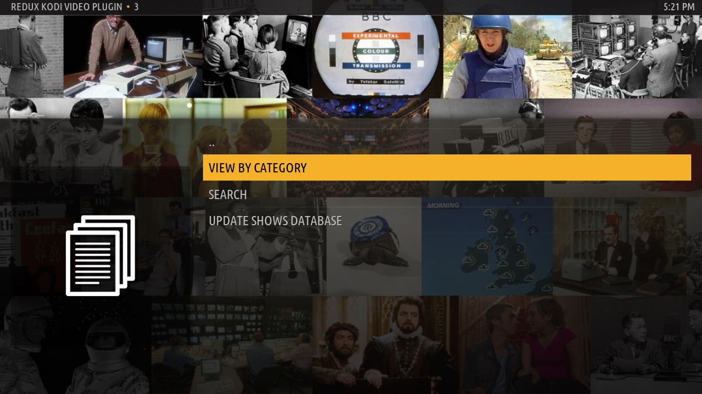
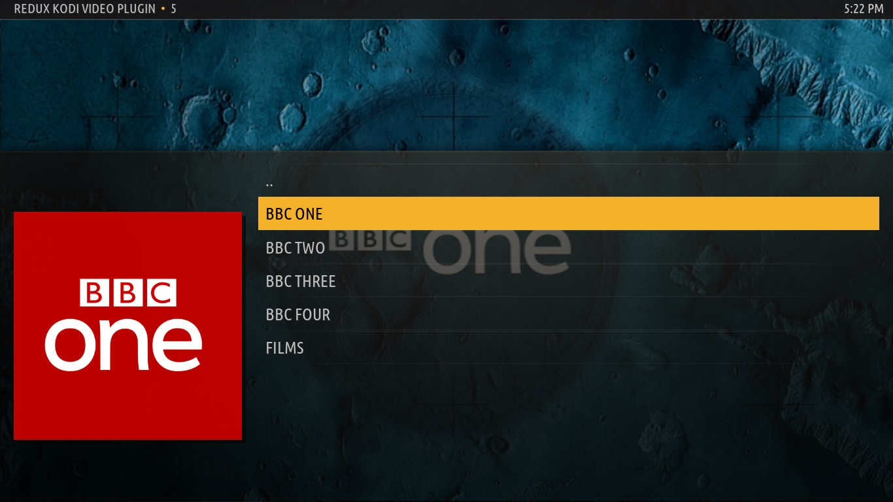
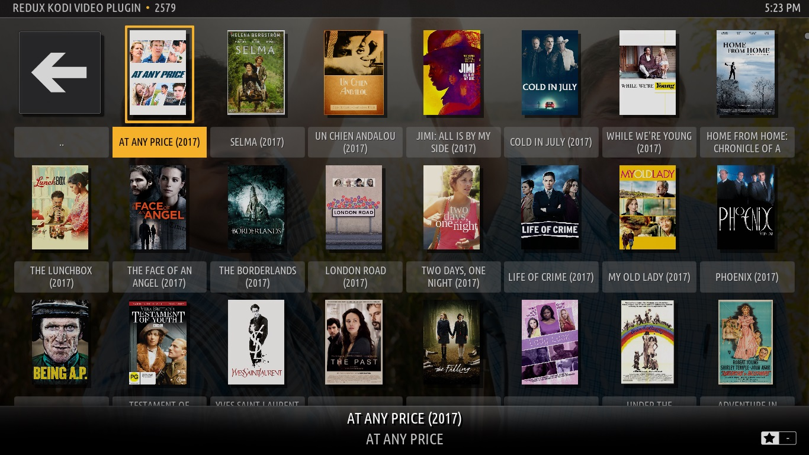
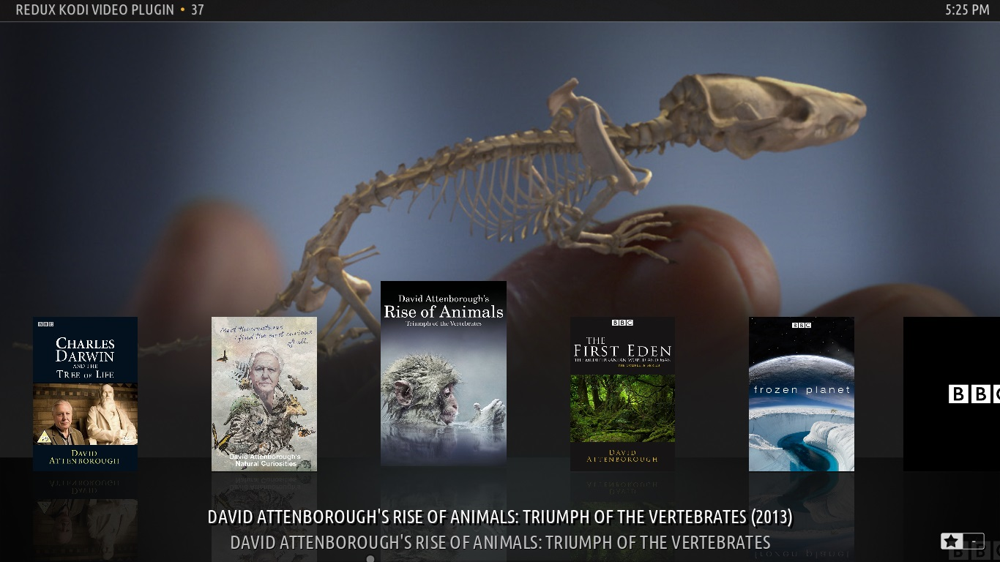
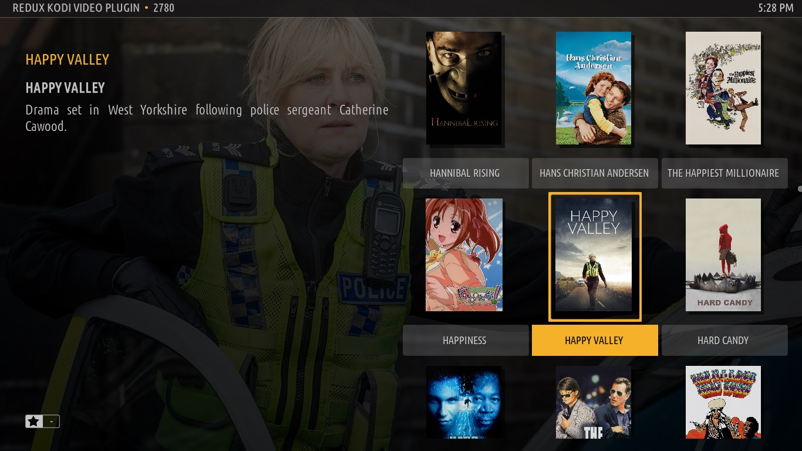

# README

## What is this?

This software is a plugin for the media center software Kodi that provides a listing of BBC programmes that were broadcast on BBC One, Two, Three and Four since 2007. I made it to experiment with public data sources, cleaning data and combining separate data sources together. So far, data from the [BBC](https://www.bbc.co.uk/programmes/), [thetvdb.com](https://thetvdb.com/), [imdb](https://imdb.com/) and [hemoviedb.org](https://www.themoviedb.org/) has been used and the latest combined dataset can be found in Pickle and JSON format in the [releases section](https://github.com/thomaspreece/kodi_redux_plugin/releases). Ultimately, the plugin is an experiment into what iPlayer may look like with a complete back-catalogue.

Note: This plugin only displays the artwork for the programmes, it does not allow you to view or download those programmes. Also note that it does not present content that was broadcast on other TV or radio channels.

## Features

Has many features including:
- Favourite shows
- Recently Added shows & seasons
- Search
- Filter by categories including channel, genre, sub-genre, broadcast year and type.
- View box art, fan art, programme and actor details in various different ways via Kodi's different layouts and themes

## What does it look like?

## Design Considerations

The addon keeps a large database of all shows that have been broadcast since 2007 and metadata associated with the shows. This is what the shows.pickle and shows.db files contain. One is a python dictionary representation of the database and the other is an sqlite database representation that is generated by the addon to speed up navigation and searching of data.

This database is mainly populated from the BBC's open /programmes API, in particular the schedules for every day since July 2007 were pulled and parsed. The database uses incremental updates so that each user that downloads the addon will only have to pull schedule information for the days after the database was compiled.
As all navigation around shows in the addon is from the local database, navigation is quick and requires no external requests to web servers (except when a update to the database is requested by the user OR when downloading artwork for shows).

None of the artwork associated with each show is stored in the database but url links to it are. As a result when you view shows in Kodi it will in the background go off and fetch the artwork and then display it to you (often storing it for later use in Kodi's internal artwork cache). The artwork urls in the database are provided exclusively from imdb, themoviedb and thetvdb.

I've tried to keep the impact of the addon on BBC services to a complete minimum, the daily schedules that are taken from the /programmes API are the only calls made to BBC services and as they are only json and done infrequently they shouldn't impact the BBC much. All heavy resources such as cover, banner and fan art are scraped from imdb, themoviedb and thetvdb and this explains why some shows don't have any artwork (and some have incorrect artwork) because they failed to match to entries in these services databases or matched to a incorrect entry. Resources from the BBC could be used instead of these services but obtaining 10,000 cover art images from the BBC would have a sizeable impact on how much the BBC pays for online services so it has been avoided.

## How do I use this?

There are a couple of ways to install this plugin.

### Installing from ThomasPreece Repo:

1. In filemanager add http://thomaspreece.com/KodiRepo/ as a source
2. Navigate to the addons menu and click 'Install From zip'. Goto the KodiRepo source and click on the "Repository.thomaspreece.kodi-plugins.zip" file to add the thomaspreece repo to your Kodi.
3. Navigate to the addons menu and click 'Install From Repo', select ThomasPreece's Repository, then Video Add-ons, then Redux Kodi Video Plugin.

### If you are installing from the Repo:

1. Clone the repo to a folder named plugin.video.redux
2. Download the separate shows.pickle file and place in the plugin.video.redux folder
3. Zip the entire folder up using your favourite software. Once zipped, double check that the structure is as follows:
plugin.video.redux.zip -> plugin.video.redux -> this repo code and shows.pickle

### Recommended Skin
At time of writing, this plugin worked best with the 'Amber' skin.

## Updating the database
The database can be updated from within the UI or using a python script. As updating can be extremely slow, it is recommended to use the script method. The file you need to run is `./script-update-NonKodi.py`.

A docker container is provided to speed up deployment of this script (and allowing for scheduling dayly). To use the docker container you'll need to mount `shows.pickle` into `/pickle` and mount somewhere on your filesystem to `/scrapes` to avoid the container having to consistently fetch old files on run.
